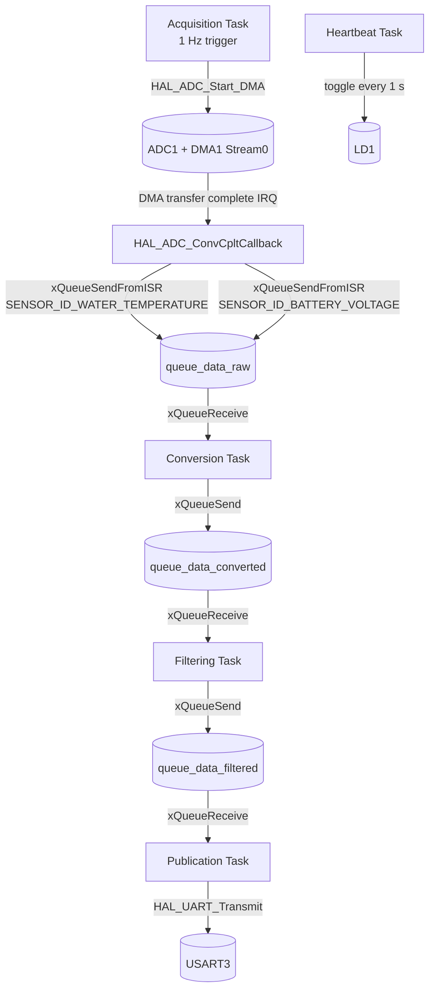
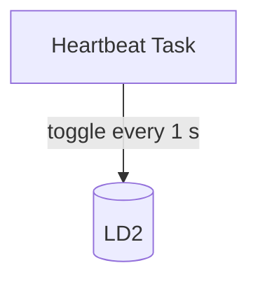

# Nucleo Firmware

Firmware for the STM32H755XI microcontroller with ARM Cortex-M7 and Cortex-M4 core, which is on a NUCLEO-H755ZI-Q board.

Currently, the M4 core handles all operations including debug output via UART. In the future, M4 will send processed sensor data to M7 via IPC (Inter-processor communication), which will manage UART communication.

## Features

- **M4 Core**
  - Status quo
    - Sensor data acquisition (ADC + DMA)
    - Data conversion
    - Data filtering
    - Debug message publication via UART (virtual serial COM port)
  - TODO
    - IPC transmission to M7
- **M7 Core**
  - TODO
    - IPC reception from M4 and UART output

## Flow Chart

### M4 Core

### M7 Core

## Build

### Requirements
- [STM32 for VS Code extension](https://marketplace.visualstudio.com/items?itemName=stmicroelectronics.stm32-vscode-extension)
- STM32CubeMX v6.17.0 (optional, for .ioc modifications)
- `git submodule init` and `git submodule update`

### Compilation

Open the workspace `fw/nucleo/` in VS Code.
- Click "Yes" on pop-up "Configure discovered Cmake projects(s) as STM32Cube project(s)?"
- Ctrl-Shift-B: Use **CMake: clean rebuild** or **CMake: build**

### Debugging

- Start debugging session "DualCore_Debug"
- On CM7 click run button

LD1 is blinking while M4 is running. LD2 is blinking while M7 is running.
