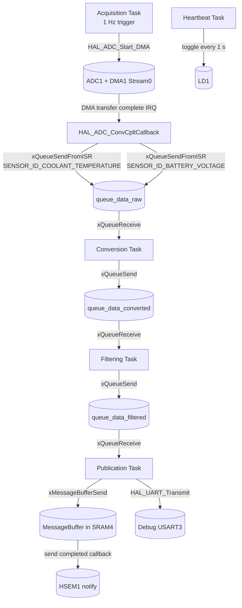
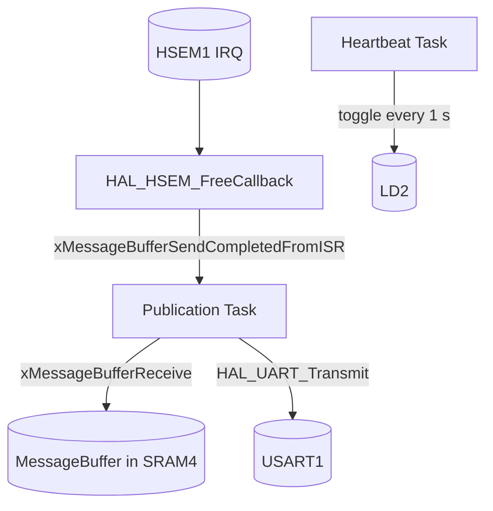

# Nucleo Firmware

Firmware for the STM32H755XI microcontroller with ARM Cortex-M7 and Cortex-M4 core, which is on a NUCLEO-H755ZI-Q board.

M4 core handles all sensor data related operations and then sends processed sensor data to M7 via IPC (Inter-processor communication), which handles UART communication.

## Features

- **M4 Core**
  - Sensor data acquisition (ADC + DMA)
  - Data conversion
  - Data filtering
  - Debug message publication via UART3 (virtual serial COM port)
  - IPC transmission to M7 via FreeRTOS message buffer in shared SRAM4 and notification via HSEM1
  - Heartbeat LED (LD1)
- **M7 Core**
  - IPC reception from shared message buffer, notification via HSEM1
  - UART1 output of received sensor messages
  - Heartbeat LED (LD2)

## Pinout

| Function                      | Core | Peripheral | Pins                 |
| ----------------------------- | ---- | ---------- | -------------------- |
| Sensor 1: Coolant temperature | M4   | ADC1_INP2  | PF11                 |
| Sensor 3: Battery voltage     | M4   | ADC1_INP3  | PA6                  |
| Debug UART                    | M4   | USART3     | PD8 (TX), PD9 (RX)   |
| Output UART                   | M7   | USART1     | PB14 (TX), PB15 (RX) |
| Heartbeat LED                 | M4   | GPIO       | PB0 (LD1)            |
| Heartbeat LED                 | M7   | GPIO       | PE1 (LD2)            |

## UART

- Baud: 115'200
- Data: 8 bit
- Stop: 1 bit
- Parity: None

### Output UART

Formatted sensor data frames:

```
<id>:<value>
```

### Debug UART

No strict format; debugging purpose only.

## Flow Chart

### M4 Core



### M7 Core



## Build

### Requirements
- [STM32 for VS Code extension](https://marketplace.visualstudio.com/items?itemName=stmicroelectronics.stm32-vscode-extension)
- STM32CubeMX v6.17.0 (optional, for .ioc modifications)
- `git submodule init` and `git submodule update`

### Compilation

Open the workspace `fw/nucleo/` in VS Code.
- Click "Yes" on pop-up "Configure discovered Cmake projects(s) as STM32Cube project(s)?"
  - Assign projects to corresponding cores
- Ctrl-Shift-B: Use **CMake: clean rebuild** or **CMake: build**

### Debugging

- Start debugging session "DualCore_Debug"
- On CM4 click run button
- On CM7 click run button

LD1 is blinking while M4 is running. LD2 is blinking while M7 is running.
